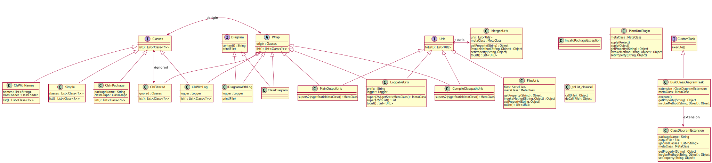

= plantuml-gradle-plugin

Gradle plugin to build PlantUML diagrams from code (for living and up-to-date documentation).

== Badges

=== Build

image:https://travis-ci.org/RoRoche/plantuml-gradle-plugin.svg?branch=master["Build Status",link="https://travis-ci.org/RoRoche/plantuml-gradle-plugin"]

=== Code coverage

https://codecov.io/gh/RoRoche/plantuml-gradle-plugin[image:https://codecov.io/gh/RoRoche/plantuml-gradle-plugin/branch/master/graph/badge.svg[codecov]]

=== Analysis

image:https://api.codacy.com/project/badge/Grade/27af97ee5790463c82961db716b6f716["Codacy code quality",link="https://www.codacy.com/manual/romain-rochegude_2/plantuml-gradle-plugin?utm_source=github.com&utm_medium=referral&utm_content=RoRoche/plantuml-gradle-plugin&utm_campaign=Badge_Grade"]
https://sonarcloud.io/dashboard?id=RoRoche_plantuml-gradle-plugin[image:https://sonarcloud.io/api/project_badges/measure?project=RoRoche_plantuml-gradle-plugin&metric=alert_status[Quality
Gate Status]]
https://sonarcloud.io/dashboard?id=RoRoche_plantuml-gradle-plugin[image:https://sonarcloud.io/api/project_badges/measure?project=RoRoche_plantuml-gradle-plugin&metric=bugs[Bugs]]
https://sonarcloud.io/dashboard?id=RoRoche_plantuml-gradle-plugin[image:https://sonarcloud.io/api/project_badges/measure?project=RoRoche_plantuml-gradle-plugin&metric=code_smells[Code
Smells]]
https://sonarcloud.io/dashboard?id=RoRoche_plantuml-gradle-plugin[image:https://sonarcloud.io/api/project_badges/measure?project=RoRoche_plantuml-gradle-plugin&metric=duplicated_lines_density[Duplicated
Lines (%)]]
https://sonarcloud.io/dashboard?id=RoRoche_plantuml-gradle-plugin[image:https://sonarcloud.io/api/project_badges/measure?project=RoRoche_plantuml-gradle-plugin&metric=ncloc[Lines
of Code]]
https://sonarcloud.io/dashboard?id=RoRoche_plantuml-gradle-plugin[image:https://sonarcloud.io/api/project_badges/measure?project=RoRoche_plantuml-gradle-plugin&metric=sqale_rating[Maintainability
Rating]]
https://sonarcloud.io/dashboard?id=RoRoche_plantuml-gradle-plugin[image:https://sonarcloud.io/api/project_badges/measure?project=RoRoche_plantuml-gradle-plugin&metric=reliability_rating[Reliability
Rating]]
https://sonarcloud.io/dashboard?id=RoRoche_plantuml-gradle-plugin[image:https://sonarcloud.io/api/project_badges/measure?project=RoRoche_plantuml-gradle-plugin&metric=security_rating[Security
Rating]]
https://sonarcloud.io/dashboard?id=RoRoche_plantuml-gradle-plugin[image:https://sonarcloud.io/api/project_badges/measure?project=RoRoche_plantuml-gradle-plugin&metric=sqale_index[Technical
Debt]]
https://sonarcloud.io/dashboard?id=RoRoche_plantuml-gradle-plugin[image:https://sonarcloud.io/api/project_badges/measure?project=RoRoche_plantuml-gradle-plugin&metric=vulnerabilities[Vulnerabilities]]

=== Dependencies

image::https://snyk.io/test/github/RoRoche/plantuml-gradle-plugin/badge.svg[Known Vulnerabilities]

=== License

TODO

=== Version

image:https://img.shields.io/maven-metadata/v?metadataUrl=https%3A%2F%2Fplugins.gradle.org%2Fm2%2Fcom%2Fgithub%2Froroche%2Fplantuml-gradle-plugin%2Fmaven-metadata.xml[Maven metadata URL]

=== Activity

TODO

=== Other

image::https://www.elegantobjects.org/badge.svg[Elegant Objects]

image::https://www.elegantobjects.org/intellij-idea.svg[intellij-idea]

https://www.rultor.com/p/yegor256/rultor[image:https://www.rultor.com/b/yegor256/rultor[DevOps
By Rultor.com]]

https://hitsofcode.com/view/github/RoRoche/plantuml-gradle-plugin[image:https://hitsofcode.com/github/RoRoche/plantuml-gradle-plugin[Hits-of-Code]]

== Dependency

Please refer to https://plugins.gradle.org/plugin/com.github.roroche.plantuml

Using the https://docs.gradle.org/current/userguide/plugins.html#sec:plugins_block[plugins DSL]:

.build.gradle
----
plugins {
    id "com.github.roroche.plantuml" version "{latest_version}" // <1>
}
----
<1> The plugin ID with the latest version.

Using https://docs.gradle.org/current/userguide/plugins.html#sec:old_plugin_application[legacy plugin application]:

.build.gradle
----
buildscript {
    repositories {
        maven {
          url "https://plugins.gradle.org/m2/" // <1>
        }
    }
    dependencies {
        classpath "com.github.roroche:plantuml-gradle-plugin:{latest_version}" // <2>
    }
}

apply plugin: "com.github.roroche.plantuml" // <3>
----
<1> Declare the repository where to look for the plugin.
<2> Declare the dependency to the plugin.
<3> Apply the plugin.

Maybe you would have to configure the plugin management with repositories where to look for plugins:

.settings.gradle
----
pluginManagement {
    repositories {
        gradlePluginPortal() // <1>
    }
}
----
<1> Include the official Gradle plugin portal.

== Configuration

.build.gradle
----
classDiagram { // <1>
    packageName = "com.github.roroche" // <2>
    outputFile = project.file('diagrams/class_diagram.plantuml') // <3>
    // outputFile = new File("${projectDir}/diagrams/class_diagram.plantuml") // <4>
    ignoredClasses = [ // <5>
            "com.github.roroche.plantuml.diagrams.Diagram\$Simple",
            "com.github.roroche.plantuml.diagrams.Diagram\$Wrap",
            "com.github.roroche.plantuml.classes.Classes\$Simple",
            "com.github.roroche.plantuml.classes.Classes\$Wrap"
    ]
}
----
<1> The name of the extension.
<2> The name of the package to scan.
<3> The file where to print the class diagram.
<4> Equivalent declaration to use explicit variable `${projectDir}`.
<5> The classes to be ignored while building the class diagram (an array of strings).

== Usage

Simply run the `buildClassDiagram` task, such as:

[source,shell]
----
./gradlew buildClassDiagram
----

== Output examples

https://github.com/RoRoche/plantuml-gradle-plugin/blob/master/diagrams/class_diagram.plantuml[Here is the output of the plugin applied to itself] (cf. previous <<Configuration>>).

[source,plantuml]
----
include::diagrams/class_diagram.plantuml[]
----

[plantuml,diagram-classes,png]
....
@startuml

class "BuildClassDiagramTask" {
  extension : ClassDiagramExtension
  metaClass : MetaClass
  execute()
  getProperty(String) : Object
  invokeMethod(String, Object) : Object
}

class "ClassDiagram"

class "ClassDiagramExtension" {
  packageName : String
  outputFile : File
  ignoredClasses : List<String>
  metaClass : MetaClass
  getProperty(String) : Object
  invokeMethod(String, Object) : Object
  setProperty(String, Object)
}

interface "Classes" {
  list() : List<Class<?>>
}

class "ClsFiltered" {
  ignored : Classes
  list() : List<Class<?>>
}

class "ClsInPackage" {
  packageName : String
  packageUrls : Collection<URL>
  reflections : Reflections
  list() : List<Class<?>>
}

class "ClsWithLog" {
  logger : Logger
  list() : List<Class<?>>
}

class "ClsWithNames" {
  names : List<String>
  list() : List<Class<?>>
}

interface "CustomTask" {
  execute()
}

interface "Diagram" {
  content() : String
  print(File)
}

class "DiagramWithLog" {
  logger : Logger
  print(File)
}

class "PlantUmlPlugin" {
  metaClass : MetaClass
  apply(Project)
  apply(Object)
  getProperty(String) : Object
  invokeMethod(String, Object) : Object
  setProperty(String, Object)
}

"BuildClassDiagramTask" --> "ClassDiagramExtension" : extension
"Classes" <-> "ClsFiltered" : /ignored
"Classes" <|-- "ClsInPackage"
"Classes" <|-- "ClsWithLog"
"Classes" <|-- "ClsWithNames"
"CustomTask" <|-- "BuildClassDiagramTask"
"Diagram" <|-- "ClassDiagram"
"Diagram" <|-- "DiagramWithLog"

@enduml
....

== Opportunity

It's possible to associate this plugin with this pretty good one: https://framagit.org/avaiss/plantuml-gradle-plugin

Here is the example of the configuration applied for this project:

.build.gradle
----
plugins {
    id "org.fmiw.plantuml" version "0.1" // <1>
}

plantuml {
    options {
        outputDir = project.file('diagrams') // <2>
    }

    diagrams {
        classes {
            sourceFile = project.file('diagrams/class_diagram.plantuml') // <3>
        }
    }
}

generateDiagramClasses.dependsOn(buildClassDiagram) // <4>
----
<1> Declare the dependency.
<2> Configure the output directory where to store SVG files.
<3> Configure the source file to provide to the plugin.
<4> Force the `buildClassDiagram` task to be performed before executing the `generateDiagramClasses` one.

== Credits

Built on top of awesome libraries:

* https://github.com/jboz/plantuml-builder
* https://github.com/ronmamo/reflections

== Icon credits

Icons made by https://www.flaticon.com/authors/eucalyp[Eucalyp] from
https://www.flaticon.com/[www.flaticon.com]
